<!-- hero: monochrome ASCII portrait (types in) beside a neofetch-style info
     panel. regenerate portrait: python scripts/prep_photo.py <photo> &&
     python scripts/make_ascii_svg.py ; info panel: python scripts/make_info_card.py -->
<table>
<tr>
<td valign="top"></td>
<td valign="top"></td>
</tr>
</table>

## Vrinda Kumar

**B.Tech Computer Science Student @ VIT Vellore · SDE Intern @ InterGlobe Technologies**

 

<!-- animated contribution graph: real data, boxes reveal cell by cell
     (regenerated daily by .github/workflows/update-profile-art.yml) -->

